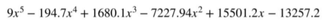

#  Finding roots of an equation with Genetic algorithm

In this project, I solved the equation below using genetic algorithm.

## Language 
This project is written in python.

## Contributing
Pull requests are welcome. For major changes, please open an issue first to discuss what you would like to change.

Please make sure to update tests as appropriate.
